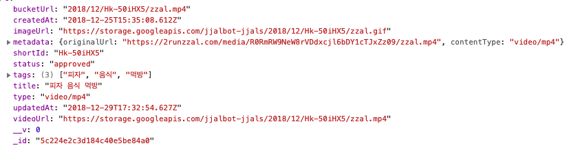

# Mission 2

## 짤봇 API를 통해 움짤 검색기 만들기

이번에는 `ajax`를 이용해 서버에서 데이터를 불러오고, 불러온 데이터로 화면을 그리는 코드를 작성합니다.

- `mssion2` 폴더 아래에 본인의 이름을 나타내는 폴더를 만듭니다.
- 해당 폴더 아래에 `index.html` 파일과 `main.js` 파일을 복사하여 놓습니다.
  - 폰인의 폴더 아래에 있는 파일이 아닌 `index.html`, `main.js`는 수정하지 마세요!
- API는 `https://jjalbot.com/api/jjals?text=검색키워드`를 이용합니다.
  - `검색키워드`로 검색된 이미지 데이터의 array가 반환됩니다.

API에서 주는 데이터는 아래 형태의 데이터를 배열로 가지고 있습니다.



## 기본 요구사항

- 변수 선언은 `var` 대신 `let`, `const`를 사용해주세요.
  - `let`에 대한 정보는 https://developer.mozilla.org/ko/docs/Web/JavaScript/Reference/Statements/let
  - `const`에 대한 정보는 https://developer.mozilla.org/ko/docs/Web/JavaScript/Reference/Statements/const 를 참고하세요.
- 저번주와 달리 각 기능을 하는 스크립트는 별도의 js 파일로 쪼개주세요.
  - 본인의 폴더 아래에 복사해둔 `index.html` 안에서 해당 스크립트들을 로딩하게 하세요.
- `search-keyword`의 input 내용이 변경되면, 해당 input 내용을 이용해 `fetch` API를 이용해 데이터를 가져옵니다.
  - 기본 코드는 미리 만들어두었습니다.
  - `fetch` 사용법은 https://developer.mozilla.org/ko/docs/Web/API/Fetch_API/Fetch%EC%9D%98_%EC%82%AC%EC%9A%A9%EB%B2%95 이 문서를 참고하세요.
- `SearchResult` 라는 이름의 컴포넌트를 만듭니다.
  - 해당 컴포넌트는 생성 시 파라메터로 두 개의 파라메터를 받습니다.
    - `data`: 렌더링에 사용할 데이터
    - `target`: html string을 렌더링 할 element의 표현식(ex: `#search-result`)
    - `function SearchResult(data, target){ .... }`
  - 이전에 진행했던 것처럼 해당 컴포넌트는 `setState`, `render` 함수를 갖고 있습니다. `render` 함수 호출 시 `search-result`라는 id의 div에 `setState`

## Bonus

- `fetch` 하는 코드를 별도의 모듈로 분리하세요.
- `fetch`는 기본적으로 `Promise`를 반환합니다.
  - `Promise`에 대해서는 https://developer.mozilla.org/ko/docs/Web/JavaScript/Reference/Global_Objects/Promise 를 참고해주세요.
  - 이 특성을 이용해 `then` 호출 대신 `async`, `await` 키워드를 이용하는 코드로 바꿔보세요.
- 각종 방어코드와 사용자 경험을 좋게 만드는 추가해보세요.
  - 검색 결과가 없을 때는 어떤 걸 보여주면 좋을까요?
  - 현재 화면에 그려진 데이터가 어떤 검색어로 검색된 결좌인지 보여주면 더 좋겠죠?
  - 그 외 데이터에 들어있는 많은 값들로 화면을 풍부하게 만들어봅시다.

## Bonus - Hard

- html 내에 `search-input` input을 지우고 `SearchInput` 이라는 컴포넌트를 만듭니다.
  - `#search-input`에 관련된 작업을 해당 컴포넌트로 모두 옮깁니다.
  - 해당 컴포넌트의 render는 무엇을 어디에 렌더링하면 될까요?
- app div 아래에 있는 div들을 모두 지웁니다.
  - `App` 이라는 이름의 컴포넌트를 만듭니다.
  - 해당 컴포넌트를 new 키워드로 생성 시 `SearchInput`, `SearchResult` 컴포넌트를 생성하도록 하고 각 컴포넌트가 렌더링 될
  - 지금은 입력할 때마다 검색이 실행되는데, 이럴경우 매우 많은 ajax 요청이 가게 됩니다.
    - 키보드 입력이 끝난 이후 일정 시간이 지난 후에 `fetch`가 실행되도록 고쳐봅니다.
    - hint: debounce - https://www.zerocho.com/category/JavaScript/post/59a8e9cb15ac0000182794fa

## Tip

- `SearchResult` 컴포넌트의 화면을 그리는 부분을 작성하면서 코드를 고칠 때마다 input을 입력하고 해당 데이터로 화면을 다시 그리는 걸 확인하는 것이 매우 귀찮을 수 있습니다.
  - 이럴 때는 `fetch` 하는 코드를 주석처리하고, 아래의 dummy data를 활용해서 `SearchResult` 의 data 파라메터로 활용해보세요.

```javascript
const dummyData = [
  {
    _id: "5c2258053d184c40e5be90d1",
    tags: ["제3의 매력", "피자", "먹방"],
    status: "approved",
    shortId: "XYv-lnmlJ",
    title: "제3의 매력 피자 먹방",
    type: "video/mp4",
    videoUrl:
      "https://storage.googleapis.com/jjalbot-jjals/2018/12/XYv-lnmlJ/zzal.mp4",
    bucketUrl: "2018/12/XYv-lnmlJ/zzal.mp4",
    metadata: {
      originalUrl:
        "https://2runzzal.com/media/SnJpMDdrSUwzNmJ1MlBndHFqRXVtZz09/zzal.mp4",
      contentType: "video/mp4"
    },
    createdAt: "2018-12-25T16:17:09.416Z",
    updatedAt: "2018-12-29T19:34:23.177Z",
    __v: 0,
    imageUrl:
      "https://storage.googleapis.com/jjalbot-jjals/2018/12/XYv-lnmlJ/zzal.gif"
  },
  {
    _id: "5c2257c33d184c40e5be907f",
    tags: ["매운녀", "매워", "세상에이런일이", "피자", "핫소스"],
    status: "approved",
    shortId: "VAXe_cxo3",
    title: "매운녀 매워 세상에이런일이 피자 핫소스",
    type: "video/mp4",
    videoUrl:
      "https://storage.googleapis.com/jjalbot-jjals/2018/12/VAXe_cxo3/zzal.mp4",
    bucketUrl: "2018/12/VAXe_cxo3/zzal.mp4",
    metadata: {
      originalUrl:
        "https://2runzzal.com/media/VVhjOEVxamFDUjRkckdtVmdQZkNPZz09/zzal.mp4",
      contentType: "video/mp4"
    },
    createdAt: "2018-12-25T16:16:03.314Z",
    updatedAt: "2018-12-29T19:31:30.827Z",
    __v: 0,
    imageUrl:
      "https://storage.googleapis.com/jjalbot-jjals/2018/12/VAXe_cxo3/zzal.gif"
  },
  {
    _id: "5c2251f53d184c40e5be8953",
    tags: ["한입만", "여친", "일타쌍피", "피자 한입만"],
    status: "approved",
    shortId: "DVNQE3d-g",
    title: "한입만 여친 일타쌍피 피자 한입만",
    type: "video/mp4",
    videoUrl:
      "https://storage.googleapis.com/jjalbot-jjals/2018/12/DVNQE3d-g/zzal.mp4",
    bucketUrl: "2018/12/DVNQE3d-g/zzal.mp4",
    metadata: {
      originalUrl:
        "https://2runzzal.com/media/ZXR0OE1IT2hvY1RKQm52b2gwSWJsZz09/zzal.mp4",
      contentType: "video/mp4"
    },
    createdAt: "2018-12-25T15:51:17.707Z",
    updatedAt: "2018-12-29T18:20:12.149Z",
    __v: 0,
    imageUrl:
      "https://storage.googleapis.com/jjalbot-jjals/2018/12/DVNQE3d-g/zzal.gif"
  },
  {
    _id: "5c2251ba3d184c40e5be8909",
    tags: ["피자", "자르기", "음식"],
    status: "approved",
    shortId: "_I2hnE8FGS",
    title: "피자 자르기 음식",
    type: "video/mp4",
    videoUrl:
      "https://storage.googleapis.com/jjalbot-jjals/2018/12/_I2hnE8FGS/zzal.mp4",
    bucketUrl: "2018/12/_I2hnE8FGS/zzal.mp4",
    metadata: {
      originalUrl:
        "https://2runzzal.com/media/Z0VzeVNCaGFuTmpQL3BNYit5RnljZz09/zzal.mp4",
      contentType: "video/mp4"
    },
    createdAt: "2018-12-25T15:50:18.312Z",
    updatedAt: "2018-12-29T18:17:14.982Z",
    __v: 0,
    imageUrl:
      "https://storage.googleapis.com/jjalbot-jjals/2018/12/_I2hnE8FGS/zzal.gif"
  }
]

const searchResult = new SearchResult(dummyData, '#search-result');
....

```

- 데이터의 흐름에 대해 잘 생각해보세요.
  - 어떤 행동에 의해 어떠한 데이터를 얻고
  - 해당 데이터로 어떤 행위를 하고
  - 그 행위로 얻어진 데이터는 또 어떻게 사용되어서
  - 최종적으로 렌더링까지 이어지는지
- 이 흐름을 머릿 속에 잘 그리면서 코딩하면 좋습니다.

이번 세션에서는 저번보다 요구사항도 많고 작성해야 할 코드가 많습니다. 저번 세션에서 했었던 것등을 잘 생각해가면서, 코딩 중 막히거나 어려움을 마주치는 경우는 주저없이 슬랙의 `qna` 채널을 잘 활용해보세요. 다른 사람의 PR을 보는 것도 도움이 많이 됩니다.

행운을 빕니다!
